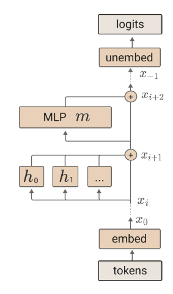
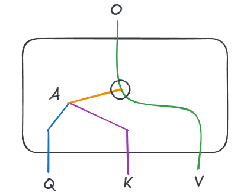
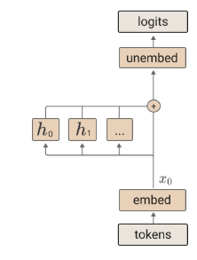
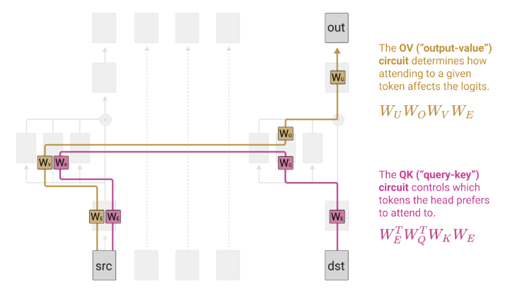

# A Mathematical Framework for Transformer Circuits

## Transformer architecture

Start with a token embedding $x_0 = W_Et$.

Each residual block is processed as follows:
1. Multi-head attention: $x_{i+1} = x_i + \sum_{h \in H_i} h(x_i)$.
2. MLP layer: $x_{i+1} = x_{i+1} + m(x_{i+1})$.
3. Final logits produced by applying the unembedding matrix: $T(t) = W_U x_{-1}$.

## Residual stream

The residual stream is a central object of the architecture. There are a few important properties/implications:

### Communication channel analogy
Layers never process the output of the previous layer. Instead, they read from the stream, process information, and write their result back to the stream.
- As a result, layers can interact out of order. The modern can choose which layers it wants to go through and otherwise go through the residual connection.
- Most of the computation the model does goes through a couple of layers in practice. 
- Some paths matter and most paths don't matter. The goal for interpretability is to focus on paths that matter through the residual stream instead of trying to understand the stream itself (which is extremely complicated due to how much composition takes place).

### Linear structure 

The layers only interact with the residual stream in a linear way (either through addition or a linear map).
- The residual stream doesn't have a "priviledged basis". There are no directions where it is naturally aligned. These normally occur when there are non-linear structures to the network (such as applying ReLU). 
- What does have a priviledged basis? The tokens, the vocabulary, the output logits, the attention patterns, the MLP.
- There are some priviledged directions in the residual stream as a result of floating point arithmetic. Similarly, using the Adam optimizer also induces priviledged directions.

### Virtual weights

At layer $A$ of the network:
- We have a writer to the stream through the output matrix $W_O^A$.
- We have a reader from the stream using the input matrix $W_I^A$.

However, because the stream is linear, Layer 10 is looking at the sum of all previous layers. This means it can look at all the previous layers, and look directly at a circuit layer $B$.

The connection is expressed as $W_I^B \cdot W_O^A$, which is what the paper refers to as a virtual weight.

A useful way to think about it is in terms of bandwidtch and subspaces:
- Layer $A$ writes its information into a specific direction (subspace) of the high-dimensional residual stream.
- Layer $B$ also listens to a specific direction (subspace) of the residual stream.
- Bandwidth:
    - The virtual weight will be large when $B$ is listening to the same subspace as $A$.
    - To the contrary, if $B$ is an orthogonal subspace, the virtual weight will be near zero.

## Attention heads

The paper describes the role of attention heads as the way to move information between tokens in the residual stream. The attention layers are the only bits of the transformer that can move information between positions.

### OV-Circuit
1. Compute the value vector for each token $v_i = W_Vx_i$, i.e. $V = xW_V^T$
2. Compute a result vector by linearly combining vectors according to the attention pattern $r_i = \sum_j A_{i, j} v_j$, i.e. $R = AV = AxW_V^T$
3. Compute the output vector for each head $h(x)_i = W_O r_i$, i.e. $h(x) = RW_O^T = Ax(W_OW_V)^T$.

 It is pretty difficult to interpret the value vector since they are the output of $W_{OV} = W_O W_V$ that is invariant under several transformations of $W_O$, $W_V$.
- $W_{OV}$ is a big matrix that has a low-rank factorization (since $H$ is much smaller than $M$).

- $W_O W_V$ (The OV Circuit): Determines what information to move. It controls the "content" or "transmission" system. It asks: "Once I am paying attention to that token, what information should I copy from it and how should I use it?"
### QK-circuit

The attention matrix is defined as $A = \operatorname{softmax}(q^\top k)$ where $q = W_Q x$ and $k = W_K x$. Expanding the expression we have $A = \operatorname{softmax}(x^\top W_Q^\top W_K x)$.
- $W_{QK} = W_Q^\top W_K$ is another low-rank decomposition.

Even those this has the same dimension as $W_{OV}$, they are fundamentally doing different operations.
- $W_Q^T W_K$ (The QK Circuit): Determines where to move information from. It controls the "routing" or "addressing" system. It asks: "Which previous token should I pay attention to?"

One of the important consequences is that attention is "almost linear" (and is linear when we fix $A$).

### Residual circuit

## Zero Layer Transformers

This is a simple model that takes a token, embeds it, and unembeds it to produce logits:
$$T(t) = W_U W_Et.$$
- There is a single end-to-end path from the input tokens to the output logits. 
- Everything along the path is linear.
- The path is heavily contrained because there is no positional information (from attention).
- It can't use earlier tokens to predict the next token, it can only use the current token.

This means that the optimal behavior of $W_UW_E$ is approximating bigram statistics.

## One Layer Transformers

Note that 
$$
\begin{align*}
T(t) &= x_1W_U^T \\
&= \left(x_0 + \sum_{h \in H_1} A^hx_0W_{OV}^T\right) W_U^T\\
&= tW_E^TW_U^T + \sum_{h \in H_1}A^ht W_E^TW_{OV}^TW_U^T \\
&= t(W_UW_E)^T + \sum_{h \in H_1} A^h t (W_UW_{OV}W_E)^T 
\end{align*}
$$
The first term is the same direct path from input tokens to output logits that corresponds to bigram statistics.

In the second term, first note that $A^h = t^\top (W_E^T W_{QK}^h W_E) t$.
- $W_E^T W_{QK}^h W_E$ is the QK-circuit. This describes how much a given query token wants to attend a given key token.
- $W_U W_{OV}^hW_E$ is the OV circuit. It describes how a given token will affect the logits if attended to.

## Two-layer Attention-only Transformers

Time for a two layer attention-only transformer.
$$
\begin{align*}
T(t) &= (I \otimes W_U) x_2 \\
&= (I \otimes W_U) \left(I + \sum_{h \in H_2} A^h \otimes W_{OV}^{h}\right)x_1 \\
&= (I \otimes W_U) \left(I + \sum_{h \in H_2} A^h \otimes W_{OV}^h\right) \left(I + \sum_{h \in H_1} A^h \otimes W_{OV}^h\right)x_0 \\
&= (I \otimes W_U) \left(I + \sum_{h \in H_2} A^h \otimes W_{OV}^h\right) \left(I + \sum_{h \in H_1} A^h \otimes W_{OV}^h\right) (I \otimes W_E)t \\ 
&= \underbrace{\text{Id} \otimes W_U W_E}_{\substack{\text{Direct Path} \\ \text{Contributes to bigram statistics}}} + \underbrace{\sum_{h \in H_1} A^h \otimes (W_U W_{OV}^h W_E)}_{\substack{\text{Layer 1 Attention Heads} \\ \text{Standard heads acting on original input}}} \\
&+ \underbrace{\sum_{h \in H_2} A^h \otimes (W_U W_{OV}^h W_E)}_{\substack{\text{Layer 2 Attention Heads} \\ \text{Standard heads acting on original input}}} + \underbrace{\sum_{h_2 \in H_2} \sum_{h_1 \in H_1} (A^{h_2} A^{h_1}) \otimes (W_U W_{OV}^{h_2} W_{OV}^{h_1} W_E)}_{\substack{\text{Virtual Attention Heads (V-Composition)} \\ \text{Composition of two heads into one logical unit} \\ \text{Allows two-hop information movement}}}
\end{align*}$$
### Two layer attention scores

First, recall that the attention pattern is $A^h = \operatorname{softmax}(t^TC_{QK}^ht)$, where $C_{QK}^h$ ios the QK-circuit.
- For the first layer attention heads, $C_{QK}^{h_1} = x_0^T W_{QK}^h x_0 = W_E^T W_{QK}^h W_E$.
- In the second layer, $C_{QK}^{h_2} = x_1^T W_{QK}^h x_1$, where $x_1$ is the residual stream after the first layer attention heads.

Let's break it down starting with $x_1 = x_0 + \sum_{h \in H_1} h(x_0) := x_0 + A_1$.
We have 
$$
\begin{align*}
C_{QK}^{h_2} &= (x_0 + A_1)^T W_Q^TW_K(x_0 + A_1) \\
&= \underbrace{x_0^T W_Q^TW_Kx_0}_{\text{No Comp}} + \underbrace{A_1^TW_Q^TW_Kx_0}_{\text{Q-Comp}} + \underbrace{x_0^TW_Q^T W_KA_1}_{\text{K-Comp}} + \underbrace{A_1^TW_Q^TW_KA_1}_{\text{Mixed}}
\end{align*}
$$

- No composition in the first term.
    - Both the Query and Key interact directly with the raw token embedding ($x_0$). This is standard attention.
- The second term is Q-composition:
    -  The attention score comes from a Query derived from Layer 1's output ($A_1$) matching against a Key derived from the raw token embedding ($x_0$).
    - Interpretation: The Layer 2 head uses the context calculated by Layer 1 to decide what to look for, but it looks for it in the original token embeddings
- The third term is K-composition: 
    - The attention score comes from a Query derived from the raw token embedding ($x_0$) matching against a Key derived from Layer 1's output ($A_1$).
    - Interpretation: The Layer 2 head uses a standard search query (based on the current token), but the past tokens use Layer 1 information to "shift" or "change" how they match that query. 
- The last term is combining both Q and K composition: 
    - The attention score comes from a Query derived from Layer 1's output ($A_1$) matching against a Key derived from Layer 1's output ($A_1$).
    - Interpretation: The head routes information based entirely on the abstract relationships calculated by Layer 1, ignoring the raw token identities completely for the routing decision.

## Copying and Induction

In one-layer transformers, most attention heads dedicate an enormous fraction of their capacity to copying:
- The OV circuits sets things up so that tokens increase the probability of that token (and to a lesser extext similar tokens).
- [a] ... [b] -> [a]

In two layer transformers, they learn a much more powerful mechanism that the paper refers to as induction:
- [a][b] ... [a] -> [b].

They dive much more into induction heads in the paper *Olsson, et al., "In-context Learning and Induction Heads", Transformer Circuits Thread, 2022* ([link](https://transformer-circuits.pub/2022/in-context-learning-and-induction-heads/index.html)).

# Resources 

Elhage, et al., "A Mathematical Framework for Transformer Circuits", Transformer Circuits Thread, 2021.

Neel Nanda's *A Walkthrough of A Mathematical Framework for Transformer Circuits* ([link](https://www.youtube.com/watch?v=KV5gbOmHbjU&t=1917s)) was also helpful in putting together these notes.

*Olsson, et al., "In-context Learning and Induction Heads", Transformer Circuits Thread, 2022* ([link](https://transformer-circuits.pub/2022/in-context-learning-and-induction-heads/index.html)).

Gemini 3: ([link](https://gemini.google.com/share/58175f15c6a7))